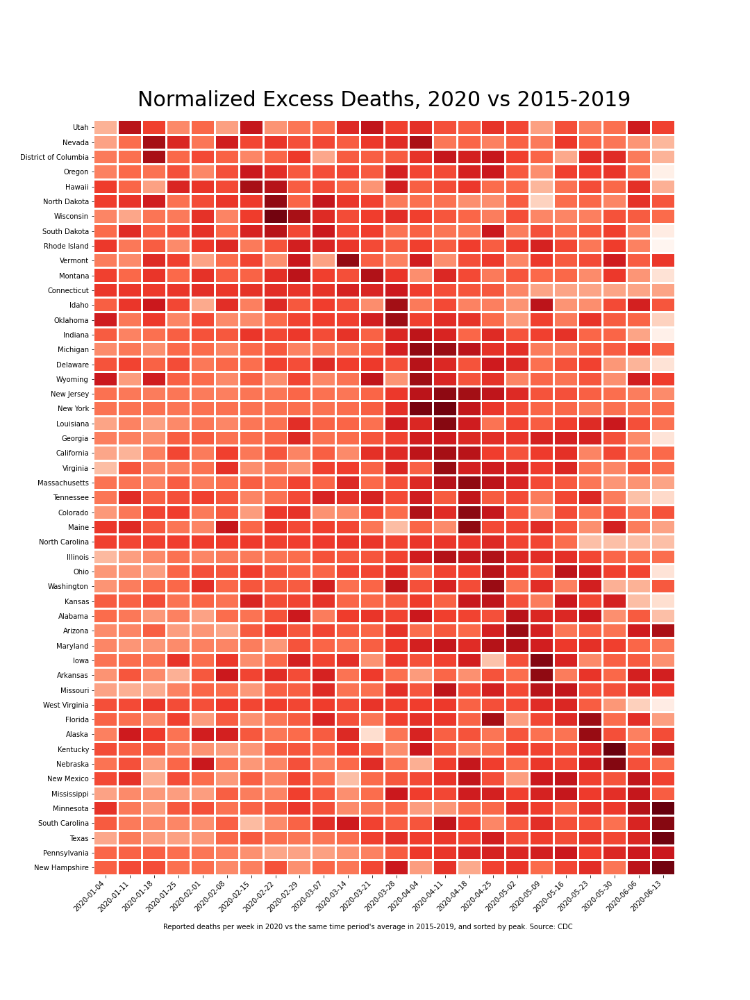

# Covid-19 Analysis Workbooks

In the early days of the pandemic, I became interested in finding what I could about the spread rate of COVID-19. There are some good nuggets among the notebook, including a notebook where I discovered, before it was reported, that Iowa was underreporting their numbers. The expected rate of infection in Iowa was less than that of Hawaii, and unlike an island state, they didn't have a good excuse. 

Other analyses in these files are mostly meant for me to explore some various ways of visualizing the data. My favorite from all of these is the county-by-county heatmap (pictured below, be sure to view the full version).

Much of the data that was available at the time is no longer available online, but some of it is archived in the Data folder if you were interested in recreating some of the work yourself. 

## County-by-County Heatmap

(This is reduced for bandwidth & page loading reasons. For the full version, [click here](https://github.com/DavidMorton/COVID-19-Analysis/raw/master/Output/Animated%20Map%20-%20County%20Spread%20Rate-3H.mp4).)

## Incidence Rate Heatmap

## Heatmap

