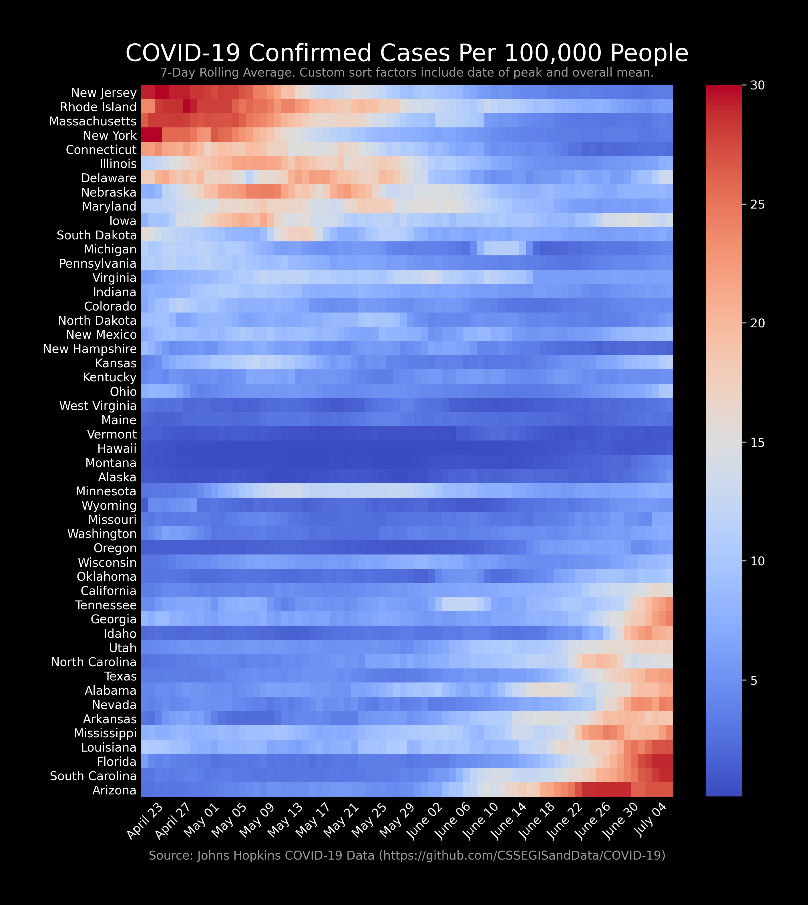

# Covid-19 Analysis Workbooks

In these workbooks, I've taken some data from the CDC and from Johns Hopkins University and used it as a playground for some DS and storyboarding practice. 

As a note, there might be crazy things in these notebooks, as it's very much a work in progress and something that I just do for fun. 

