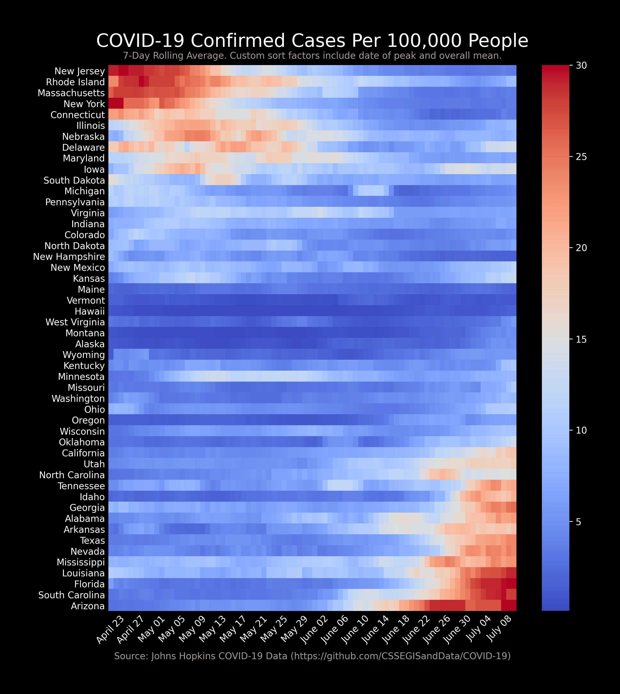

# Covid-19 Analysis Workbooks

In these workbooks, I've taken some data from the CDC and from Johns Hopkins University and used it as a playground for some DS and storyboarding practice. 

As a note, there might be crazy things in these notebooks, as it's very much a work in progress and something that I just do for fun. 

## County-by-County Heatmap

(This is reduced for bandwidth & page loading reasons. For the full version, [click here](https://github.com/DavidMorton/COVID-19-Analysis/raw/master/Output/Animated%20Map%20-%20County%20Spread%20Rate-3H.mp4).)

## Incidence Rate Heatmap

